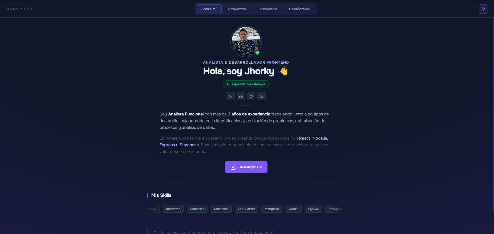

# 🌐 Jhorky Dev | Portafolio

¡Hola! Soy Jhorky, un desarrollador web enfocado en construir experiencias digitales sólidas, rápidas y accesibles.

---

## 🚀 Tecnologías destacadas

  

---

## 🧩 ¿Qué vas a encontrar en este portafolio?

- 🖼️ **Proyectos destacados** con enlace a repos y demos
- 🛠️ Stack tecnológico por proyecto
- 💼 Experiencia y habilidades principales
- 📫 Información de contacto

---

## 📷 Vista previa

---

## 📎 Enlaces importantes

- 🔗 [Demo online](https://jhorky-dev.netlify.app)  
- 📁 [Repositorio](https://github.com/jhorky91/jhorky-dev)  
- 📬 [LinkedIn](https://www.linkedin.com/in/jhorkyescalante/)

---

## 📜 Licencia

Este proyecto está bajo la [MIT License](LICENSE).

---

